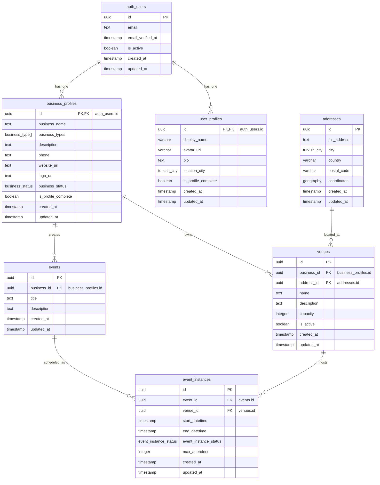

**Note**: This design is not final and can be changed with user permissions and requirements.

```mermaid
erDiagram
    auth_users ||--o{ user_profiles : "has_one"
    auth_users ||--o{ business_profiles : "has_one"

    auth_users {
        uuid id PK
        text email
        timestamp email_verified_at
        boolean is_active
        timestamp created_at
        timestamp updated_at
    }

    user_profiles {
        uuid id PK, FK "auth_users.id"
        varchar display_name
        varchar avatar_url
        text bio
        turkish_city location_city
        boolean is_profile_complete
        timestamp created_at
        timestamp updated_at
    }

    business_profiles {
        uuid id PK, FK "auth_users.id"
        text business_name
        business_type[] business_types
        text description
        text phone
        text website_url
        text logo_url
        business_status business_status
        boolean is_profile_complete
        timestamp created_at
        timestamp updated_at
    }

    addresses {
        uuid id PK
        text full_address
        turkish_city city
        varchar country
        varchar postal_code
        geography coordinates
        timestamp created_at
        timestamp updated_at
    }

    venues {
        uuid id PK
        uuid business_id FK "business_profiles.id"
        uuid address_id FK "addresses.id"
        text name
        text description
        integer capacity
        boolean is_active
        timestamp created_at
        timestamp updated_at
    }

    events {
        uuid id PK
        uuid business_id FK "business_profiles.id"
        text title
        text description
        timestamp created_at
        timestamp updated_at
    }

    event_instances {
        uuid id PK
        uuid event_id FK "events.id"
        uuid venue_id FK "venues.id"
        timestamp start_datetime
        timestamp end_datetime
        event_instance_status event_instance_status
        integer max_attendees
        timestamp created_at
        timestamp updated_at
    }

    business_profiles ||--o{ venues : "owns"
    business_profiles ||--o{ events : "creates"
    addresses ||--o{ venues : "located_at"
    venues ||--o{ event_instances : "hosts"
    events ||--o{ event_instances : "scheduled_as"
```